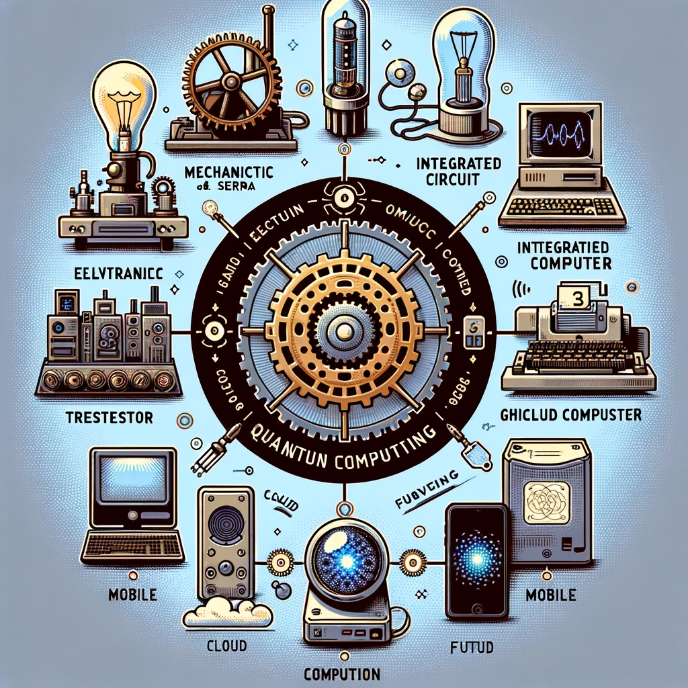

# 计算机和服务器硬件的进化

计算机和服务器硬件的发展经历了多个重要的阶段，以下是这些领域的简要总结。

## 计算机发展历史：

- **机械计算机时代（1642-1940年代）**: 最早的计算机设备，如布莱兹·帕斯卡的计算机和查尔斯·巴贝奇的差分机，都是机械的。
- **电子计算机时代（1940-1950年代）**: 电子计算机的诞生，如ENIAC，使用了大量的电子管。
- **晶体管计算机时代（1950-1960年代）**: 晶体管替代了电子管，使计算机变得更小、更可靠、耗电更少。
- **集成电路时代（1960年代至今）**: 集成电路（IC）的出现极大提升了计算能力和效率。
- **个人计算机革命（1970-1990年代）**: 苹果、IBM、微软推动了PC的普及。
- **移动与云计算时代（2000年代至今）**: 智能手机、平板电脑的流行。云计算提供了通过互联网访问计算资源的能力。

## 服务器硬件发展：

- **大型机时代**: 早期的服务器是大型计算机，通常占据了整个房间。
- **小型机时代**: 服务器变得更小、更强大。
- **集群服务器**: 服务器开始采用集群形式，分布式计算成为常态。
- **刀片服务器**: 刀片服务器通过将多个服务器模块集成到一个底座中来提高空间利用率。
- **虚拟化**: 软件虚拟化技术允许单个服务器同时运行多个操作系统和应用程序。
- **GPU和加速计算**: GPU和其他加速硬件开始用于高性能计算和AI。
- **超融合与云基础设施**: 超融合基础设施整合计算、存储和网络。
- **能源效率和绿色计算**: 服务器硬件也在向着更高能效和低碳排放的方向发展。

## 当前和未来趋势：

- **量子计算**: 量子计算机的发展可能引起计算范式的巨变。
- **神经形态计算**: 神经形态芯片模仿人脑结构，实现更有效的人工智能。

计算机和服务器硬件的发展不仅是技术进步的证明，也是人类智慧的结晶。随着技术的不断进步，未来的计算机和服务器将更加强大、高效和智能。

